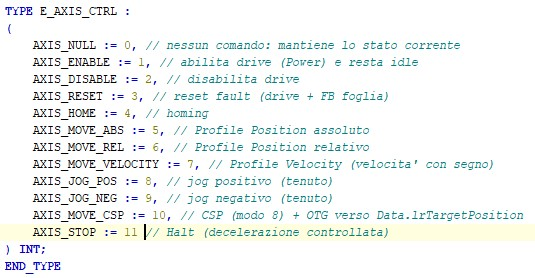
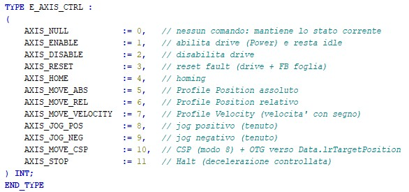

**English** | [Italiano](README.it.md)

# STFormat

**A code formatter for Structured Text (IEC 61131-3)** — for **TwinCAT** and **CoDeSys**.
It indents, spaces, normalizes keyword casing and **aligns to columns** (with tabs) declarations,
assignments, enum members and comments. Available as a **command-line tool** and a **desktop GUI**.

Inspired by [STWEEP](https://www.stweep.com/) and [TcBlack](https://github.com/Roald87/TcBlack); free and open-source (MIT).


## Before / After

A real enum, before and after `stformat` (column alignment of `:=` and comments, using tabs):

| Before | After |
|--------|-------|
|  |  |

## What it does

- **Indentation** for blocks (`IF/ELSE/ELSIF`, `FOR`, `WHILE`, `REPEAT/UNTIL`, `CASE` with labels, `VAR*`, `STRUCT`, enum `TYPE … ( … )`).
- **Consistent spacing** around operators, calls, indexing, member access and unary signs.
- **Keyword casing** normalization (UPPER / lower / preserve).
- **Column alignment with TABS** of `:` and `:=` in declarations, `:=` in assignments and enum members, and end-of-line comments.
- Works directly on TwinCAT **`.TcPOU` / `.TcGVL` / `.TcDUT`** files (only the ST inside the CDATA is touched — minimal diffs, CRLF preserved) and on **CoDeSys exports** / plain ST.
- **`--check`** mode for CI / pre-commit, **`--diff`**, recursive folder processing.

## Safety: it never changes semantics

The engine is built on a **lossless lexer** (re-concatenating the tokens reproduces the source exactly).
Formatting only changes *trivia* (spaces, tabs, newlines) and keyword casing: the sequence of code
tokens stays invariant. It is also **idempotent** — formatting twice yields the same result.
Covered by a test suite (lexer, formatting, alignment, `.TcPOU` round-trip).

## Installation

### Windows (recommended)
Download the **standalone** executable from the latest [Release](../../releases/latest) — no .NET install required:
- `stformat.exe` (command line)
- `STFormat-GUI.exe` (graphical interface)

### From source (Windows / macOS / Linux)
Requires the [.NET SDK 10](https://dotnet.microsoft.com/download).
```bash
git clone https://github.com/elconfa/STFormat.git
cd STFormat
dotnet build -c Release
```

## Usage — command line

```bash
# Format in place, files and/or folders (recurses over .TcPOU/.TcGVL/.TcDUT/.TcIO/.exp/.st)
stformat src/

# Preview without writing
stformat --diff   MyFb.TcPOU
stformat --stdout MyFb.TcPOU

# CI / pre-commit: exits with code 1 if anything would change
stformat --check src/

# From stdin (plain ST, e.g. a CoDeSys export)
cat code.st | stformat --stdin

# Style options
#   --use-tabs           indent with tabs instead of spaces
#   --indent-size N      indent with N spaces (default 4)
#   --tab-width N        tab width used for alignment (default 4)
#   --keywords MODE      upper | lower | preserve
```

In TwinCAT XML files, only the ST code inside the `<Declaration>` and `<ST>` CDATA sections is
formatted; the rest of the XML is left untouched (minimal diffs, CRLF preserved).

## Usage — graphical interface

Pick a file or folder, tweak the settings, and see a live **Before / After** preview.
Run `STFormat-GUI.exe`, or from source:
```bash
dotnet run --project src/STFormat.Gui
```

## Comparison

| | STFormat | STWEEP | TcBlack |
|---|:---:|:---:|:---:|
| License | MIT (free) | commercial | MIT (free) |
| Command line | ✅ | ✅ | ✅ |
| Graphical interface | ✅ | ✅ | — |
| Column alignment | ✅ (tabs) | ✅ | partial |
| TwinCAT `.TcPOU` files | ✅ | ✅ | ✅ |
| CoDeSys export / plain ST | ✅ | ✅ | — |
| Plugin inside the TwinCAT editor | in progress | ✅ | ✅ |

## Project layout

| Project | Target | Role |
|---------|--------|------|
| `STFormat.Core` | netstandard2.0 | engine: lexer + formatting + alignment |
| `STFormat.Cli` | net10.0 | command-line tool (`stformat`) |
| `STFormat.Gui` | net10.0 | desktop GUI (Avalonia, cross-platform) |
| `STFormat.Tests` | net10.0 | tests (xUnit) |

```bash
dotnet test STFormat.slnx      # run the test suite
```

## Roadmap

- **VSIX** plugin for the TwinCAT XAE 4026 editor (a "Format Document" command), reusing `STFormat.Core`.
- Alignment of parameters in multi-line function-block calls.
- Distribution via `dotnet tool` and winget.

## Contributing

Issues and feature requests are welcome via [Issues](../../issues). If some construct is formatted
sub-optimally, attach a small before/after snippet — it's the fastest way to add the case and a
regression test. See [CONTRIBUTING.md](CONTRIBUTING.md) for how to build, test and submit changes.

## License and credits

[MIT](LICENSE). Inspired by **STWEEP** and by **TcBlack** by Roald Nefs.
